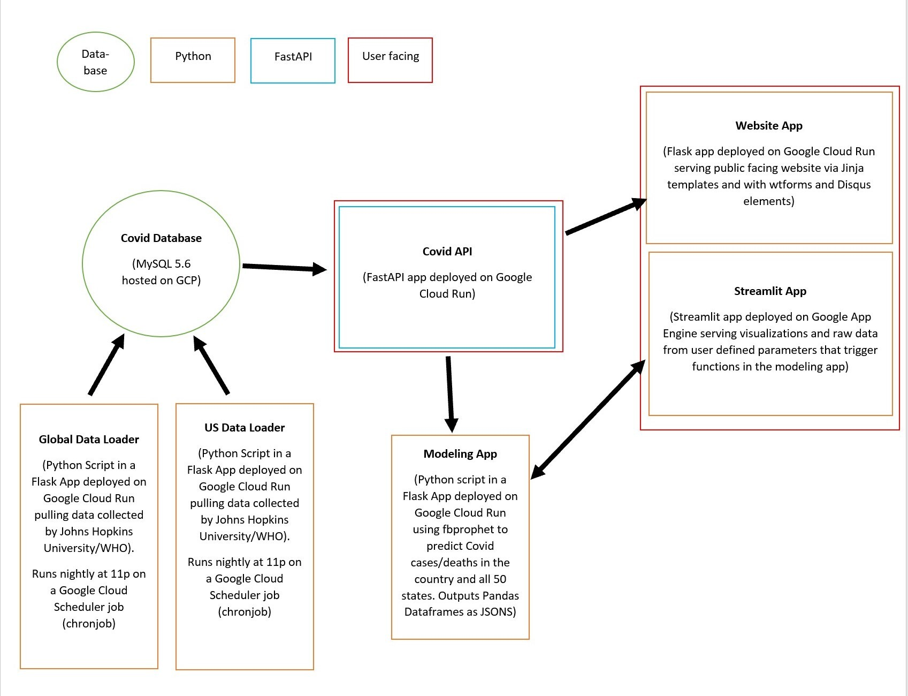

# Coronavirus COVID-19 Dashboard

Interactive dashboard to explore COVID-19 data from Johns Hopkins University and providing free API.
This project aims to predict the number of new daily cases and deaths of COVID-19 in USA.

### Link to the App: **NOTE** Hosting temporarily removed due to cost of hosting on the cloud. Link will be updated once hosting has been resumed. 

### To run localy the predictions:
streamlit run streamlit_interface.py

### Update frequency:
Once a day around 08:00 PM (CDT).

### Data Sources:
https://github.com/CSSEGISandData/COVID-19/tree/master/csse_covid_19_data

https://data.worldbank.org/indicator/sp.pop.65up.to.zs

https://api-pc6dbtrtla-uc.a.run.app/docs

### Model:
We used Prophet model developed by Facebook for producing forecasts for the future Covid-19 cases and deaths in the US.
More information about Prophet model can be found at https://facebook.github.io/prophet/.

### Technologies:
* Flask
* Flask SQLAlchemy
* Fast API
* Google Cloud Platform
* HTML and CSS
* JavaScript
* Jinja
* MySQL
* Plotly
* Postman
* Python 
* Prophet
* SQLAlchemy
* Streamlit 

### Github FastAPi
https://github.com/JoshuaFarmerATX/fastAPIPlayground.git

### Project Flowchart

### Project Team

Austin Spacek - Lead Developer  
Christopher Swanson - Lead Developer  
Daniela Matos - Backend Developer/Tester  
Ed Haarmann IV - Project Manager  
Josh Farmer - Frontend Developer  
Sinah Kang - Backend Developer/Tester
